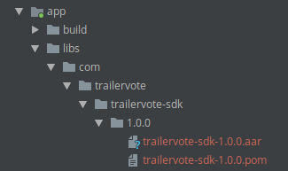

# Introduction

## Overview

The TrailerVote SDK for Android is a proprietary software library that enables moviegoer apps to increases user engagement and customer understanding by encouraging moviegoers to rate trailers at the theatre as they play on the big screen, and/or rate trailers when watched on the phone. Users are later sent push notification reminders to buy tickets via the app when the movie opens in theatres.

Features include:

- **Theatre-Optimized Audio Recognition**: Optimized to work in complex cinema environments that have reverb, echo, deep bass and lots of speakers.
- **Branding & Styling**: Customize the core listening experience with your choice of background colors and logo.
- **Offline audio recognition**: Minimizes the need for network connectivity at the cinema by downloading content whenever it possibly can.
- **Custom Recognition**: Identify trailer content, loyalty program promotions, or advertisements and serve the corresponding interactions.

## Requirements

TrailerVote SDK for Android requires:

- Android 4.4 (API 19) or higher

# Getting Started

## Installation
1. Download and unzip the newest SDK version available at https://trailervote.com/downloads/android-sdk.
2. Copy `com` directory into your project libraries directory. Example, `YourAppDir/app/libs/`.

3. In you project `gradle` file add libraries directory to repositories list.
```groovy
allprojects {
    repositories {
        maven {
            url "libs"
        }
    }
}
```
4. In your app module `gradle` file add TrailerVote SDK dependency:
```groovy
dependencies {
    implementation "com.trailervote:trailervotesdk:1.0.0@aar"
}
```

## Further steps

Head over to [Integration Guide](integration_guide) to start integrating the SDK into your app.

