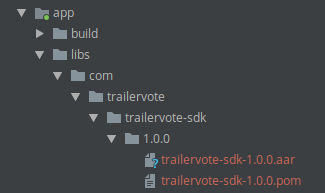

## Requirements

- Android 4.4+ (API 19+)

## Installation

1. Download and unzip the newest SDK version available at https://trailervote.com/downloads/android-sdk.
2. Copy `com` directory into your project libraries directory. Example, `YourAppDir/app/libs/`.

3. In you project `gradle` file add libraries directory to repositories list.
```gradle
allprojects {
    repositories {
        maven {
            url "libs"
        }
    }
}
```
4. In your app module `gradle` file add TrailerVote SDK dependency:
```gradle
dependencies {
    implementation "com.trailervote:trailervotesdk:1.0.0@aar"
}
```

## Usage

Initialize SDK by calling the ```TrailerVoteSdk.init(Context context)``` method.

SDK provides the main class `TrailerVoteSdk` containing the necessary methods for accessing the SDK functionality.

Read the following guide for the details on integration individual components of the SDK:

- [Product fragment integration](../product_screen_integration)
- [Trailer recognition screen integration](../trailer_recognition_screen_integration)

## SDK reference
- [Classes and Interfaces (JavaDoc)](/android/index.html)

