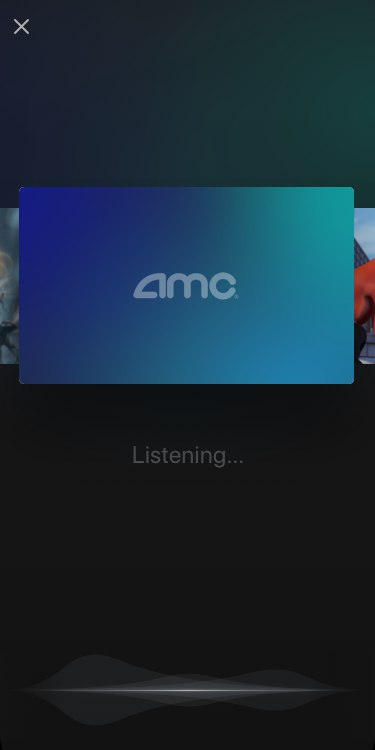

## Basic Integration

The TrailerVote SDK contains a main class ([`TrailerVoteSdk`](/android)) which contains all the methods necessary for adding the TrailerVote experience to your app.

1. Configuring and initializing the **TrailerVote SDK**
2. Enabling and configuring the **TrailerVote In-Theatre feature**
3. Enabling the **TrailerVote Video Player**
4. Enabling the **Analytics** and **Remote notifications** capabilities

## Configuring and initializing the TrailerVote SDK

The initialization process of the SDK begins immediately at the first call of `TrailerVoteSdk.init(context, backendEndpoint, username, password);`. All internal dependencies are initialized as well as public singleton instances.

To start the pre-loading process of the trailer recognition data, call the `TrailerVoteSdk.instance().load();` method.

Once the data is downloaded, the trailer recognition feature will be available in offline, but please keep the data pre-load call triggered on your app launch so that the SDK could update the recognition data.

## Enabling the TrailerVote In-Theatre feature

The main feature of the SDK is the audio recognition of movie trailers. We use the `TrailerVoteRecognitionActivity` for presenting a full-screen user interface and for handling the audio recognition process.



Navigate to recognition screen by calling the -`TrailerVoteSdk.instance().openRecognitionScreen(Context)` method of the main SDK class:

```java
boolean success = TrailerVoteSdk.instance().openRecognitionScreen(context);
if (!success) {
  // error
}
```

Note that after a trailer is recognized the SDK will render the voting buttons automatically and prompt the user to vote.


After a user votes, the feedback is recorded internally in the SDK and transmitted to TrailerVote. This means that this information is visible in the voted trailers feed and any API that exposes the vote.

*Note: Special advertisement clips are handled differently - the fullscreen `WebView` is presented with the corresponding url being loaded.*

The SDK provides the ways to set the logo image displayed at the trailer recognition screen. To set the logo image, add the drawable with the name `img_recognition_screen_partner_logo`.
You can override the default voting card background as well by adding the drawable with the name `img_recognition_screen_partner_background`.

## Enabling the TrailerVote Video Player


Because moviegoers watch trailers in your movie app, we recommend replacing your video player with the **TrailerVote Video Player**. The TrailerVote Video Player will provide a prompt during the video playback.

To launch the video player, call the

```java
TrailerVoteSdk.instance().openVideoPlayerForTrailer(context, trailerUrl, onErrorCallback);
```

The video player will automatically manage the playback queue and present the voting UI in order for user to vote on shown movies.

## Enabling the Analytics and the Remote Notifications capabilities.

Both the analytics and the remote notifications capanilities require the client token to be provided to the SDK. To begin the setup, provide your token by calling the `setRemoteAnalyticsToken(YOUR_ANALYTICS_TOKEN)` method. The key events will be sent automatically by the SDK.

```java
TrailerVoteSdk.instance().setRemoteAnalyticsToken(YOUR_ANALYTICS_TOKEN);
```

For enabling the remote notifications capability, start by calling `enablePushNotifications(deviceToken)` and `setClassForNotificationIntent(class)` methods.

```java
FirebaseInstanceId.getInstance().getInstanceId().addOnCompleteListener(new OnCompleteListener<InstanceIdResult>() {
    @Override
    public void onComplete(@NonNull Task<InstanceIdResult> task) {
        if (task.isSuccessful()) {
            TrailerVoteSdk.instance().enablePushNotifications(task.getResult().getToken());
            TrailerVoteSdk.instance().setClassForNotificationIntent(MainActivity.class);
        }
    }
}
```

When the notification is received, call the `onNotificationReceived(intentExtras, listener)` method. In order to communicate back to your app after processing the notification's extras, the SDK provides `NotificationActionListener` interface. Implement this interface to react to the notification processing result.

```java
if (intent.getAction() == Intent.ACTION_MAIN) {
  Bundle extras = intent.getExtras();
  if (extras.containsKey("trailervote_notification") {
    TrailerVoteSdk.instance().onNotificationReceived(extras, new NotificationActionListener() {
      @Override
      void onNotificationAction(@NonNull NotificationAction action, @Nullable String movieId) {
        switch (action) {
          case NotificationAction.OPEN_RECOGNITION:
            
            break;
          case NotificationAction.OPEN_MOVIE_DETAILS:
            
            break;
          case NotificationAction.OPEN_MOVIE_SHOWTIMES:
            
            break;
          case default:
            
            break;
        }
      }
    });
  }
}
```

In some time later, when you wish to stop the remote notifications capability, call the `disablePushNotifications` method to remove current device token from the notifications recipients list.

To track analytics events, the SDK provides several methods:

- `TrailerVoteSdk.instance().logTicketPurchasedEvent(movieId, quantity, totalPrice, convenienceFees, currencyCode);`
- `TrailerVoteSdk.instance().logShowtimesPageShownEvent(movieId);`

Call these methods in corresponding places in your app to submit the corresponding events.

When recognition screen is opened, the event will be submitted automatically.