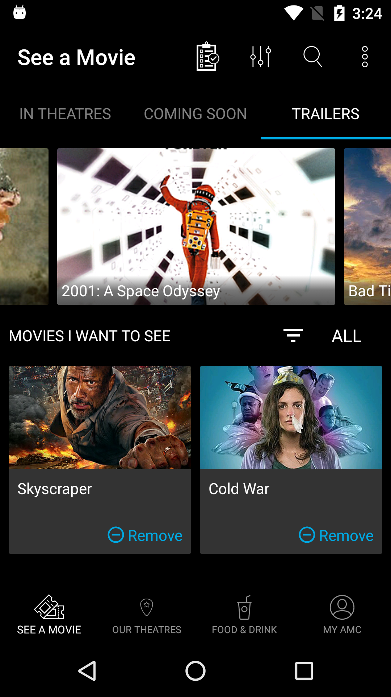
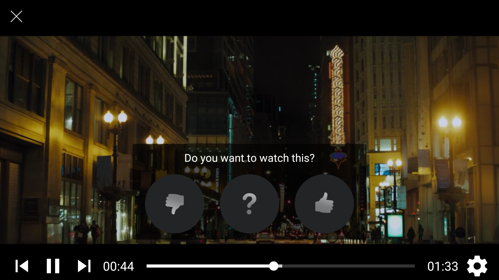

`ProductFragment` is a class responsible for fetching, displaying and launching a video player for available products. SDK provides a simple and convenient way for embedding the feed into your app's UI.



Instatntiate the fragment by calling the `newInstance()` method of the `ProductFragment` class:
```java
ProductFragment fragment = ProductFragment.newInstance();
```

When a list view is tapped, a fullscreen video player is opened automatically:


The video player provides an ability to seek through the trailers in the feed using the convenient controls. The video player also presents the user with a voting view, so that the user can rate the movie that is currently playing.



Upon voted, the trailer will be automatically added to the voted trailers feed.

