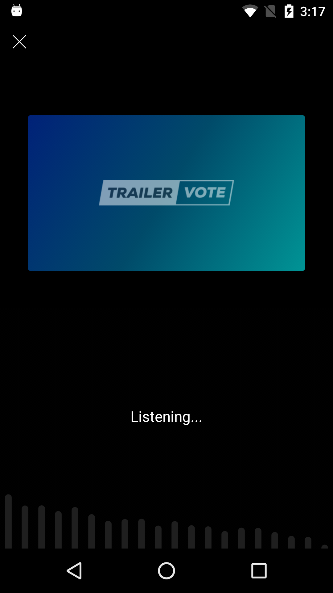
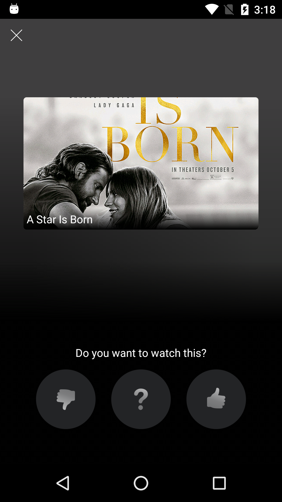

The main feature of the SDK is the audio recognition of moview trailers.



To open recognition screen call:
```java
TrailerVoteSdk.openRecognitionScreen(context)
```

You can override the logo image displayed at the trailer recognition screen. To set the logo, add a drawable with the name ```img_recognition_screen_partner_logo``` to your application resources. Example, ```app/src/main/res/drawable/img_recognition_screen_partner_logo.xml``` or ```app/src/main/res/drawable-xhdpi/img_recognition_screen_partner_logo.png```, etc.

When a trailer is recognized, the voting buttons are presented automatically, giving the user the ability to vote:



After voting, the trailer is automatically added to the voted trailers feed (See [Product screen integration](product_screen_integration)).

Special advertisement clips are handled differently - the fullscreen `WebView` is presented with the corresponding url being loaded.

