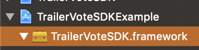
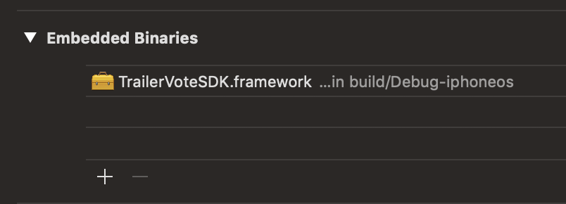

# Introduction

## Overview

The TrailerVote SDK for iOS is a proprietary software library that enables moviegoer apps to increases user engagement and customer understanding by encouraging moviegoers to rate trailers at the theatre as they play on the big screen, and/or rate trailers when watched on the phone. Users are later sent push notification reminders to buy tickets via the app when the movie opens in theatres.

Features include:

- **Theatre-Optimized Audio Recognition**: Optimized to work in complex cinema environments that have reverb, echo, deep bass and lots of speakers.
- **Branding & Styling**: Customize the core listening experience with your choice of background colors and logo.
- **Offline audio recognition**: Minimizes the need for network connectivity at the cinema by downloading content whenever it possibly can.
- **Custom Recognition**: Identify trailer content, loyalty program promotions, or advertisements and serve the corresponding interactions.

## Requirements

TrailerVote SDK for iOS requires:

- Xcode 9 or higher
- iOS 10 or higher

# Getting Started

## Installation

1. Download & unzip the latest iOS SDK from https://trailervote.com/downloads/ios-sdk.
2. Drag **TrailerVoteSDK.framework** into your Xcode project tree:  

4. In your app **Target Settings** -> **General** tab, under the Embedded Binaries section, click the **+** button and select the imported **TrailerVoteSDK.framework** item. Click the **Add** button.  

## Further steps

Head over to [Integration Guide](integration_guide) to start integrating the SDK into your app.