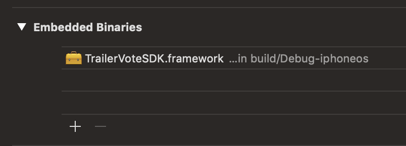
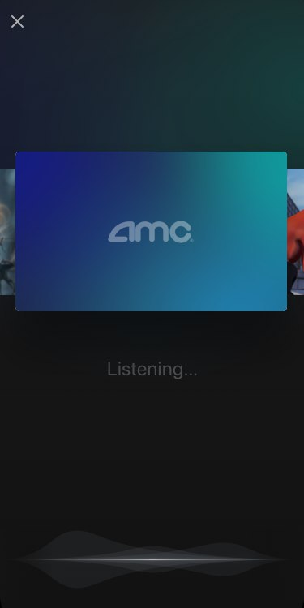
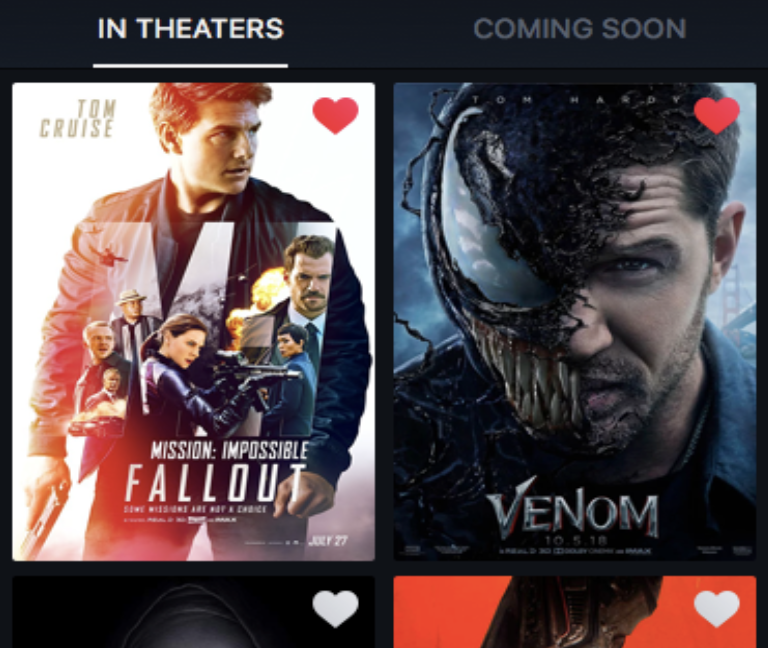
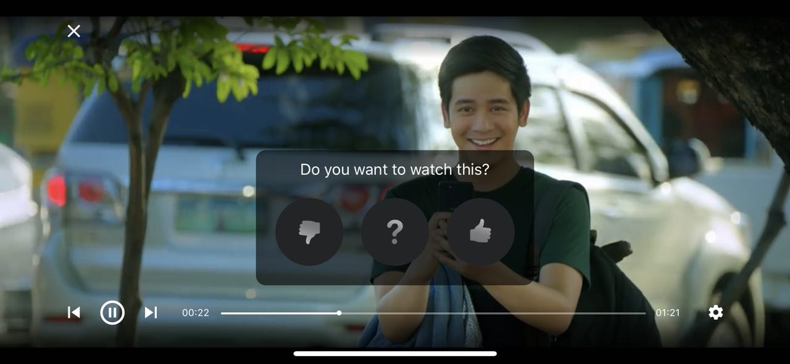

# Introduction

## Overview

The TrailerVote SDK for iOS is a proprietary software library that enables moviegoer apps to increases user engagement and customer understanding by encouraging moviegoers to rate trailers at the theatre as they play on the big screen, and/or rate trailers when watched on the phone. Users are later sent push notification reminders to buy tickets via the app when the movie opens in theatres.

Features include:

- **Theatre-Optimized Audio Recognition**: Optimized to work in complex cinema environments that have reverb, echo, deep bass and lots of speakers.
- **Branding & Styling**: Customize the core listening experience with your choice of background colors and logo.
- **Offline audio recognition**: Minimizes the need for network connectivity at the cinema by downloading content whenever it possibly can.
- **Custom Recognition**: Identify trailer content, loyalty program promotions, or advertisements and serve the corresponding interactions.

## Requirements

TrailerVote SDK for iOS requires:

- Xcode 9 or higher
- iOS 10 or higher

# Getting Started

## Installation

1. Download & unzip the latest iOS SDK from https://trailervote.com/downloads/ios-sdk.
2. Drag **TrailerVoteSDK.framework** into your Xcode project tree:  

4. In your app **Target Settings** -> **General** tab, under the Embedded Binaries section, click the **+** button and select the imported **TrailerVoteSDK.framework** item. Click the **Add** button.  


## Basic Integration

The TrailerVote SDK contains a main factory class (`TVTrailerVoteFactory`) which contains all the methods necessary for adding the TrailerVote experience to your app. Use the

```
//objective-c
+[TVTrailerVoteFactory sharedFactory]

//swift
TVTrailerVoteFactory.sharedFactory()
```

class method to access the factory singleton and then use the corresponding methods to instantiate the objects you’re interested in.

1. Configuring and initializing the **TrailerVote SDK**
2. Enabling the **TrailerVote In-Theatre feature**
3. Enabling the **TrailerVote Bookmarklet iconlet**
4. Enabling the **TrailerVote Video Player**
5. Adding **TrailerVote analytics** to key events

## Configuring and initializing the TrailerVote SDK

The initialization process of the SDK begins immediately at the first call of `[TVTrailerVoteFactory sharedFactory]`. All internal dependencies are initialized as well as public singleton instances.

To start the pre-loading process of the data needed by the SDK, call the 

```
//objective-c
[[TVTrailerVoteFactory sharedFactory] startPreLoading]

//swift
TVTrailerVoteFactory.sharedFactory().startPreLoading()
```

The SDK provides the ways to set the logo image displayed at the trailer recognition screen. To set the logo image, call the

```
//objective-c
[[TVTrailerVoteFactory sharedFactory] setPartnerLogoImage:yourUIImage]

//swift
TVTrailerVoteFactory.sharedFactory().setPartnerLogoImage(yourUIImage)
```

You can override the default voting card background as well by calling the

```
//objective-
[[TVTrailerVoteFactory sharedFactory] setDefaultVotingCardBackgroundImage:yourUIImage]

//swift
TVTrailerVoteFactory.sharedFactory().setDefaultVotingCardBackgroundImage(yourUIImage)
```

## Enabling the TrailerVote In-Theatre feature

The main feature of the SDK is the audio recognition of movie trailers. We use the `TVAudioRecognitionViewController` class for presenting a full-screen user interface and for handling the audio recognition process.



Instantiate the view controller by calling the -`[TVTrailerVoteFactory audioRecognitionViewController]` method of the main factory class:

```
let audioRecognitionVC = TVTrailerVoteFactory.shared().audioRecognitionViewController()
```

After instantiation, the audio recognition view controller can be easily presented using UIKit `present(_:animated:completion:)` method:

```
present(audioRecognitionVC, animated: true, completion: nil)
```

Note that after a trailer is recognized the SDK will render the voting buttons automatically and prompt the user to vote.


After a user votes, the feedback is recorded internally in the SDK and transmitted to TrailerVote. This means that this information is visible in the voted trailers feed and any API that exposes the vote (See [Voted trailers feed integration](voted_trailers_feed_integration) for the details).

*Note: Special advertisement clips are handled differently - the fullscreen web view is presented with the corresponding url being loaded.*

## Enabling the TrailerVote Bookmarket iconlet

Once a user has voted that they wish to see a movie, it’s important that intent is shown on the movie listings within the app. It’s also important that the movies that are bookmarked via TrailerVote are prioritized to the top of any screens showing movies available for watching.

To get the information on whether or not the user has previously voted on the given movie:

```
//objective-c
BOOL hasVoted = [[[TVTrailerVoteFactory sharedFactory] votedTrailersFeedProvider] hasVotedOnMovieWithID:someMovieID

//swift
let hasVoted = TVTrailerVoteFactory.sharedFactory().votedTrailersFeedProvider().hasVotedOnMovieWithID(someMovieID)
```



## Enabling the TrailerVote Video Player



Because moviegoers watch trailers in your movie app, we recommend replacing your video player with the **TrailerVote Video Player**. The TrailerVote Video Player will provide a prompt during the video playback. 

To launch the video player, call the

```
//objective-c
[[TVTrailerVoteFactory sharedFactory] videoPlayerWithMovieIDs:anArrayOfMovieIDs initialIndex:index]

//swift
TVTrailerVoteFactory.sharedFactory().videoPlayerWithMovieIDs(anArrayOfMovieIDs, initialIndex: index)
```

Given an array of movie ids, the video player will automatically manage the playback queue of trailers and by providing the initial index you can change the initial trailer to start playback with.

## Adding TrailerVote analytics to key events

There are 3 important events that need to be instrumented.

When a user organically opens a movie that has been bookmarked, the SDK needs to be notified via  
   
```  
//objective-c
[[[TVTrailerVoteFactory sharedFactory] analyticsManager] submitBookmarkedMovieOpenWithID:movieID]  

//swift
TVTrailerVoteFactory.sharedFactory().analyticsManager().submitBookmarkedMovieOpenWithID(movieID)
```

Use the following code to notify the SDK.

When a user is sent a push notification or SMS that deep links to a movie showtimes slow, the SDK needs to be notified of the successful transaction via the

```
//objective-c
[[[TVTrailerVoteFactory sharedFactory] analyticsManager] submitMovieShowtimesShowForMovieID:movieID]

//swift
TVTrailerVoteFactory.sharedFactory().analyticsManager().submitMovieShowtimesShowForMovieID(movieID)
```

Use the following code to notify the SDK.

When a user successful purchases a ticket, the SDK needs to be notified via the

```
//objective-c
[[[TVTrailerVoteFactory sharedFactory] analyticsManager] submitTicketPurchaseForMovieID:movieID]

//swift
TVTrailerVoteFactory.sharedFactory().analyticsManager().submitTicketPurchaseForMovieID(movieID)
```

This method will include the identifier of the movie, the theatre location, the date of the show and showtime purchased, and a corresponding source identifier that associates this purchase to any bookmarklet, push notification or SMS. This doubles in purpose to understand the effectiveness of the feature as well as sets up a push notification/local reminder at the showtime to open up the TrailerVote feature to rate trailers as they play on the big screen.

When a push notification/SMS is received that attempts to open the in-theatre audio recognition capability, the event needs to be recorded to the SDK via the

```
//objective-c
[[[TVTrailerVoteFactory sharedFactory] analyticsManager] submitAudioRecognitionScreenOpen]

//swift
TVTrailerVoteFactory.sharedFactory().analyticsManager().submitAudioRecognitionScreenOpen()
```

before calling the method to open the audio recognition UI.