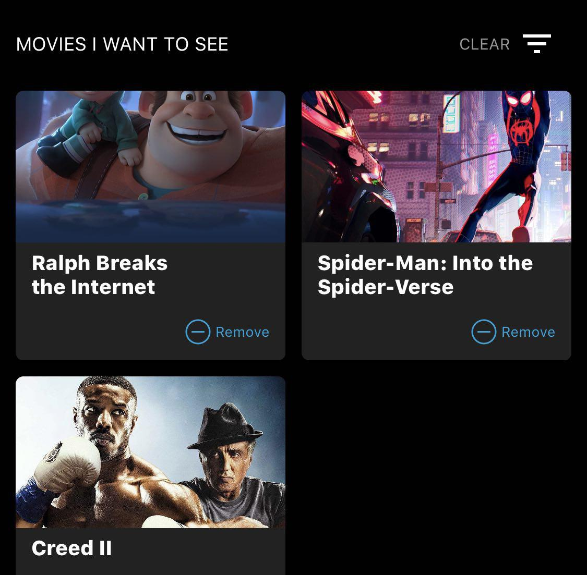
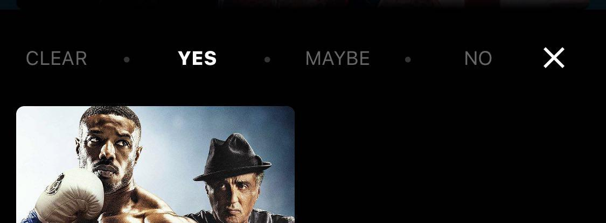

# Integration Guide

## Basic Integration

TrailerVote SDK provides the main factory class `TVTrailerVoteFactory`, containing various methods for adding the TrailerVote experience to your app.

Simply call the `[TVTrailerVoteFactory sharedFactory]`/`TVTrailerVoteFactory.shared()` class method to access the singleton instance.

Integration steps:

1. Configuring and initializing the **TrailerVote SDK**
2. Setting the data pre-load mode.
2. Enabling and configuring the **TrailerVote In-Theatre feature**
3. Presenting the **TrailerVote Video Player**
4. Integrating the **Movies carousel view**
5. Integrating the **Voted movies feed view**
6. Enabling the **Analytics** and **Remote notifications** capabilities

## Configuring and initializing the TrailerVote SDK

In order to use the SDK, you are required to provide the set of credentials (username/password). This can be done by calling the `[TVTrailerVoteFactory setupCredentialsWithUsername:password:]`/`TVTrailerVoteFactory.setupCredentials(withUsername:password:)` method.

```
//objective-c
- (BOOL)application:(UIApplication *)application didFinishLaunchingWithOptions:(NSDictionary *)launchOptions
{
    [TVTrailerVoteFactory setupCredentialsWithUsername:@"YOUR_USERNAME"password:@"YOUR_PASSWORD"];
    return YES;
}

//swift
func application(_ application: UIApplication, didFinishLaunchingWithOptions launchOptions: [UIApplicationLaunchOptionsKey: Any]?) -> Bool {
    TVTrailerVoteFactory.setupCredentials(withUsername:"YOUR_USERNAME" password:"YOUR_PASSWORD")
    return true
}
```

Please note that the invocation of this method should precede any other calls on the SDK factory class, otherwise an exception will be thrown indicating the absence of credentials.

The initialization process of the SDK begins immediately upon the first invocation of `[TVTrailerVoteFactory sharedFactory]`/`TVTrailerVoteFactory.shared()` method. All internal dependencies and SDK resources are initialized automatically.

In order for the **TrailerVote In-Theatre feature** to work offline, the movie trailers recognition data needs to be downloaded from the network.

To start the pre-loading process of the trailer recognition data, call the `[[TVTrailerVoteFactory sharedFactory] launchDataPreload]`/`TVTrailerVoteFactory.shared().launchDataPreload()` method.

```
//objective-c
- (BOOL)application:(UIApplication *)application didFinishLaunchingWithOptions:(NSDictionary *)launchOptions
{
    [TVTrailerVoteFactory setupCredentialsWithUsername:@"YOUR_USERNAME"password:@"YOUR_PASSWORD"];
    [[TVTrailerVoteFactory sharedFactory] launchDataPreload];
    return YES;
}

//swift
func application(_ application: UIApplication, didFinishLaunchingWithOptions launchOptions: [UIApplicationLaunchOptionsKey: Any]?) -> Bool {
    TVTrailerVoteFactory.setupCredentials(withUsername:"YOUR_USERNAME" password:"YOUR_PASSWORD")
    TVTrailerVoteFactory.shared().launchDataPreload()
    return true
}
```

Once the data is downloaded, the trailer recognition feature will be available in offline, but please keep the data pre-load call triggered on your app launch so that the SDK could update the recognition data.

## Setting the data pre-load mode.

The SDK provides several data pre-load modes to fit the client needs such as bad network conditions etc. The default mode loads all the data during the pre-load process. Two other available options are `TVPreloadModeNoImagesPreload` that skips pre-downloading the movie images until a particular image is needed for showing up in the voting card and `TVPreloadModeNoImagesAtAll` that completely disable the image load.

To set the pre-load mode, call the `TVTrailerVoteFactory.shared().setPreloadMode(<PRELOAD_MODE>)/[[TVTrailerVoteFactory sharedFactory] setPreloadMode:<PRELOAD_MODE>]` method after setting up the credentials for the SDK.

```
//objective-c
- (BOOL)application:(UIApplication *)application didFinishLaunchingWithOptions:(NSDictionary *)launchOptions
{
    [TVTrailerVoteFactory setupCredentialsWithUsername:@"YOUR_USERNAME"password:@"YOUR_PASSWORD"];
    [[TVTrailerVoteFactory sharedFactory] setPreloadMode:TVPreloadModeNormal];
    [[TVTrailerVoteFactory sharedFactory] launchDataPreload];
    return YES;
}

//swift
func application(_ application: UIApplication, didFinishLaunchingWithOptions launchOptions: [UIApplicationLaunchOptionsKey: Any]?) -> Bool {
    TVTrailerVoteFactory.setupCredentials(withUsername:"YOUR_USERNAME" password:"YOUR_PASSWORD")
    TVTrailerVoteFactory.shared().setPreloadMode(.normal)
    TVTrailerVoteFactory.shared().launchDataPreload()
    return true
}
```

## Enabling and configuring the TrailerVote In-Theatre feature

The main feature of the SDK is the movie trailers recognition. To present the full-screen UI of the feature, call the `[[TVTrailerVoteFactory sharedFactory] presentTrailerRecognitionViewController:recognitionDelegate:]`/`TVTrailerVoteFactory.shared().presentTrailerRecognitionViewController(_:recognitionDelegate:)` method.


```
//objective-c
@interface ViewController : UIViewController <TVAudioRecognitionViewControllerNewDelegate>
@end

@implementation ViewController
- (void)launchTrailerRecognition
{
    [[TVTrailerVoteFactory sharedFactory] presentTrailerRecognitionViewController:self recognitionDelegate:self];
}
@end

//swift
class ViewController: UIViewController, TVAudioRecognitionViewControllerNewDelegate {
    func launchTrailerRecognition() {
        TVTrailerVoteFactory.shared().presentTrailerRecognitionViewController(self, recognitionDelegate: self)
    }
}
```

When the movie trailer is recognized, the voting buttons are shown with the prompt for the user to vote.


After the user votes, the feedback is recorded internally in the SDK and transmitted to TrailerVote. This means that this information is visible in the voted trailers feed and any API that exposes the vote.

*Note: Special advertisement clips, such as ad banners or special action triggers are handled differently - the fullscreen web view is presented with the corresponding url being loaded or some other UI elements are presented, such as the "Put your phones away" view.*

The SDK provides the ability to set the logo image displayed on the initial movie card. Call the `[[TVTrailerVoteFactory sharedFactory] setPartnerLogoImage:]`/`TVTrailerVoteFactory.shared().setPartnerLogoImage(_:)` method providing your own logo image to use.

```
//objective-c
- (BOOL)application:(UIApplication *)application didFinishLaunchingWithOptions:(NSDictionary *)launchOptions
{
    [TVTrailerVoteFactory setupCredentialsWithUsername:@"YOUR_USERNAME"password:@"YOUR_PASSWORD"];
    [[TVTrailerVoteFactory sharedFactory] launchDataPreload];
    [[TVTrailerVoteFactory sharedFactory] setPartnerLogoImage:<YOUR_IMAGE>];
    return YES;
}

//swift
func application(_ application: UIApplication, didFinishLaunchingWithOptions launchOptions: [UIApplicationLaunchOptionsKey: Any]?) -> Bool {
    TVTrailerVoteFactory.setupCredentials(withUsername:"YOUR_USERNAME" password:"YOUR_PASSWORD")
    TVTrailerVoteFactory.shared().launchDataPreload()
    TVTrailerVoteFactory.shared().setPartnerLogoImage(<YOUR_IMAGE>)
    return true
}
```

## Presenting the TrailerVote Video Player


Because moviegoers watch trailers in your movie app, we recommend replacing your video player with the **TrailerVote Video Player**. The TrailerVote Video Player will provide a prompt for voting during the video playback. 

To get the video player instance, call the `[[TVTrailerVoteFactory sharedFactory] presentVideoPlayerViewController:movieTrailerURL:]`/`TVTrailerVoteFactory.shared().presentVideoPlayerViewController(_:movieTrailerURL:)` method.

```
//objective-c
@interface ViewController : UIViewController
@end

@implementation ViewController
- (void)launchVideoPlayer
{
    [[TVTrailerVoteFactory sharedFactory] presentVideoPlayerViewController:self movieTrailerURL:<TRAILER_URL>];
}
@end

//swift
class ViewController: UIViewController {
    func launchVideoPlayer() {
        TVTrailerVoteFactory.shared().presentVideoPlayerViewController(self, movieTrailerURL:<TRAILER_URL>)
    }
}
```

## Integrating the Movies carousel view


The SDK provies the ready for use movies carousel view that can be easily integrated into your UI by using the `[[TVTrailerVoteFactory sharedFactory] productCarouselViewControllerEmbeddedInParentViewController:parentView:]`/`TVTrailerVoteFactory.shared().productCarouselViewControllerEmbedded(inParentViewController:parentView:)` method. The view incapsules the necessary logic for fetching the movies list, presenting the data for each movie as well as launching the **TrailerVote Video Player** upon the selection of the particular item in the feed.

```
//objective-c
@interface ViewController : UIViewController
@property (nonatomic, weak) IBOutlet UIView * movieCarouselContainerView;
@end

@implementation ViewController
{
    TVProductCarouselViewController * _productCarouselVC;
}

- (void)viewDidLoad
{
    [super viewDidLoad];
    _productCarouselVC = [[TVTrailerVoteFactory sharedFactory] productCarouselViewControllerEmbeddedInParentViewController:self parentView:self.movieCarouselContainerView];
}
@end

//swift
class ViewController: UIViewController {
    @IBOutlet weak var movieCarouselContainerView: UIView!
    private var productCarouselVC: TVProductCarouselViewController!

    override func viewDidLoad() {
        super.viewDidLoad()
        productCarouselVC = TVTrailerVoteFactory.shared().productCarouselViewControllerEmbedded(inParentViewController: self, parentView: movieCarouselContainerView)
    }
}
```

## Integrating the Voted movies feed view



The SDK also provides the voted movies feed view for presenting the list of movies the user has previously voted on. To embed the view into your UI, call the `[[TVTrailerVoteFactory sharedFactory] votedTrailerFeedViewControllerEmbeddedInParentViewController:parentView:]`/`TVTrailerVoteFactory.shared().votedTrailerFeedViewControllerEmbedded(inParentViewController:parentView:)` method.



The view incapsulates the necessary logic for fetching the voted movies list, provides the capability of filtering the movies by the vote type (all, positive, neutral or negative), as well as launching the **TrailerVote Video Player** upon the selection of the particular item in the feed.

```
//objective-c
@interface ViewController : UIViewController
@property (nonatomic, weak) IBOutlet UIView * votedMoviesFeedContainerView;
@end

@implementation ViewController
{
    TVVotedTrailersFeedViewController * _votedTrailersFeedVC;
}

- (void)viewDidLoad
{
    [super viewDidLoad];
    _votedTrailersFeedVC = [[TVTrailerVoteFactory sharedFactory] votedTrailersFeedViewControllerEmbeddedInParentViewController:self parentView:self.votedMoviesFeedContainerView];
}
@end

//swift
class ViewController: UIViewController {
    @IBOutlet weak var votedMoviesFeedContainerView: UIView!
    private var votedTrailersFeedVC: TVVotedTrailersFeedViewController!

    override func viewDidLoad() {
        super.viewDidLoad()
        votedTrailersFeedVC = TVTrailerVoteFactory.shared().votedTrailersFeedViewControllerEmbedded(inParentViewController: self, parentView: votedTrailersFeedContainerView)
    }
}
```

## Enabling the Analytics and the Remote Notifications capabilities.

Both the analytics and the remote notifications capabilities require the client token to be provided to the SDK. To begin the setup, provide your token by calling the `[TVTrailerVoteFactory setupAnalyticsToken:]`/`TVTrailerVoteFactory.setupAnalyticsToken(_:)` method. The key events will be sent automatically by the SDK.

```
//objective-c
- (BOOL)application:(UIApplication *)application didFinishLaunchingWithOptions:(NSDictionary *)launchOptions
{
    [TVTrailerVoteFactory setupCredentialsWithUsername:@"YOUR_USERNAME"password:@"YOUR_PASSWORD"];
    [TVTrailerVoteFactory setupAnalyticsToken:@"YOUR_ANALYTICS_TOKEN"];
    [[TVTrailerVoteFactory sharedFactory] launchDataPreload];
    return YES;
}

//swift
func application(_ application: UIApplication, didFinishLaunchingWithOptions launchOptions: [UIApplicationLaunchOptionsKey: Any]?) -> Bool {
    TVTrailerVoteFactory.setupCredentials(withUsername:"YOUR_USERNAME" password:"YOUR_PASSWORD")
    TVTrailerVoteFactory.setupAnalyticsToken("YOUR_ANALYTICS_TOKEN")
    TVTrailerVoteFactory.shared().launchDataPreload()
    return true
}
```

Some analytics events require the SDK to know the current launch method for the app (organic, via a remote notification, deeplink etc). In order for the SDK to be able to do that, call the `[TVTrailerVoteFactory application:didFinishLaunchingWithOptions:]/TVTrailerVoteFactory.application(_:didFinishLaunchingWithOptions:)` method after setting the analytics token.

```
//objective-c
- (BOOL)application:(UIApplication *)application didFinishLaunchingWithOptions:(NSDictionary *)launchOptions
{
    [TVTrailerVoteFactory setupCredentialsWithUsername:@"YOUR_USERNAME"password:@"YOUR_PASSWORD"];
    [TVTrailerVoteFactory setupAnalyticsToken:@"YOUR_ANALYTICS_TOKEN"];
    [TVTrailerVoteFactory application:application didFinishLaunchingWithOptions:launchOptions];
    [[TVTrailerVoteFactory sharedFactory] launchDataPreload];
    return YES;
}

//swift
func application(_ application: UIApplication, didFinishLaunchingWithOptions launchOptions: [UIApplicationLaunchOptionsKey: Any]?) -> Bool {
    TVTrailerVoteFactory.setupCredentials(withUsername:"YOUR_USERNAME" password:"YOUR_PASSWORD")
    TVTrailerVoteFactory.setupAnalyticsToken("YOUR_ANALYTICS_TOKEN")
    TVTrailerVoteFactory.application(application, didFinishLaunchingWithOptions: launchOptions)
    TVTrailerVoteFactory.shared().launchDataPreload()
    return true
}
```

For enabling the remote notifications capability, start by calling the `[[TVTrailerVoteFactory sharedFactory] enablePushNotificationsWithDeviceID:]`/`TVTrailerVoteFactory.shared().enablePushNotifications(withDeviceID:)` method. The `deviceID` parameter is the hexadecimal string retrieved from the device token provided by the iOS in your application's delegate class `-application:didRegisterForRemoteNotificationsWithDeviceToken:`/ `application(_:didRegisterForRemoteNotificationsWithDeviceToken:)` method.

```
//objective-c
- (void)application:(UIApplication *)application didRegisterForRemoteNotificationsWithDeviceToken:(NSData *)deviceToken
{
    const char *data = [deviceToken bytes];
    NSMutableString *token = [NSMutableString string];
    for (NSUInteger i = 0; i < [deviceToken length]; i++)
    {
        [token appendFormat:@"%02.2hhX", data[i]];
    }
    NSString * tokenString = [token copy];
    [[TVTrailerVoteFactory sharedFactory] enablePushNotificationsWithDeviceID:tokenString];
}

//swift
func application(_ application: UIApplication, didRegisterForRemoteNotificationsWithDeviceToken deviceToken: Data) {
  TVTrailerVoteFactory.shared().enablePushNotifications(withDeviceID: deviceToken.map { String(format: "%02.2hhx", $0) }.joined())
}
```

Upon receiving the remote notification's payload dictionary in `-application:didReceiveRemoteNotification:fetchCompletionHandler:`/`application(_:didReceiveRemoteNotification:completionHandler:)` or `-application:didFinishLaunchingWithOptions:`/`application(_:didFinishLaunchingWithOptions:)` method, call the `[[TVTrailerVoteFactory sharedFactory] processPushNotificationPayload:]`/`TVTrailerVoteFactory.shared().TVTrailerVoteFactory.shared().processPushNotificationPayload(_:)` method in order for the SDK to process and react accordingly to the notification's payload data.

```
//objective-c
- (BOOL)application:(UIApplication *)application didFinishLaunchingWithOptions:(NSDictionary *)launchOptions
{
    [TVTrailerVoteFactory setupCredentialsWithUsername:@"YOUR_USERNAME"password:@"YOUR_PASSWORD"];
    [TVTrailerVoteFactory setupAnalyticsToken:@"YOUR_ANALYTICS_TOKEN"];
    [[TVTrailerVoteFactory sharedFactory] launchDataPreload];
    id remoteNotificationPayload = [launchOptions objectForKey:UIApplicationLaunchOptionsRemoteNotificationKey];
    if (remoteNotificationPayload && [remoteNotificationPayload isKindOfClass:NSDictionary.class])
    {
        [[TVTrailerVoteFactory sharedFactory] processPushNotificationPayload:(NSDictionary *)remoteNotificationPayload];
    }
    return YES;
}

- (void)application:(UIApplication *)application didReceiveRemoteNotification:(NSDictionary *)userInfo fetchCompletionHandler:(void (^)(UIBackgroundFetchResult))completionHandler
{
    [[TVTrailerVoteFactory sharedFactory] processPushNotificationPayload:userInfo];
    completionHandler(UIBackgroundFetchResultNoData);
}

//swift
func application(_ application: UIApplication, didFinishLaunchingWithOptions launchOptions: [UIApplicationLaunchOptionsKey: Any]?) -> Bool {
    TVTrailerVoteFactory.setupCredentials(withUsername:"YOUR_USERNAME" password:"YOUR_PASSWORD")
    TVTrailerVoteFactory.setupAnalyticsToken("YOUR_ANALYTICS_TOKEN")
    TVTrailerVoteFactory.shared().launchDataPreload()
    if let remoteNotificationPayload = launchOptions?[.remoteNotification] as? [AnyHashable: Any] {
        TVTrailerVoteFactory.shared().processPushNotificationPayload(remoteNotificationPayload)
    }
    return true
}

func application(_ application: UIApplication, didReceiveRemoteNotification userInfo: [AnyHashable : Any], fetchCompletionHandler completionHandler: @escaping (UIBackgroundFetchResult) -> Void) {
    TVTrailerVoteFactory.shared().processPushNotificationPayload(userInfo)
    completionHandler(.noData)
}
```

In order to communicate back to your app after processing the notification's payload, the SDK provides the `TVRemoteNotificationsDelegate` protocol. Implement this protocol in your app's delegate class and set the `delegate` property of SDK's factory class to react to the payload processing results.

```
//objective-c
@interface AppDelegate : UIResponder <UIApplicationDelegate, TVRemoteNotificationsDelegate>
@property (strong, nonatomic) UIWindow *window;
@end

@implementation AppDelegate
- (BOOL)application:(UIApplication *)application didFinishLaunchingWithOptions:(NSDictionary *)launchOptions 
{
    [TVTrailerVoteFactory setupCredentialsWithUsername:@"YOUR_USERNAME"password:@"YOUR_PASSWORD"];
    [TVTrailerVoteFactory setupAnalyticsToken:@"YOUR_ANALYTICS_TOKEN"];
    [[TVTrailerVoteFactory sharedFactory] launchDataPreload];
    [[TVTrailerVoteFactory sharedFactory].remoteNotificationsDelegate = self;
    return YES;
}

- (void)openShowtimesForMovieID:(NSInteger)movieID
{
    // navigate to the corresponding movie showtimes screen
}
@end

//swift
@UIApplicationMain
class AppDelegate: UIResponder, UIApplicationDelegate, TVRemoteNotificationsDelegate {
    func application(_ application: UIApplication, didFinishLaunchingWithOptions launchOptions: [UIApplicationLaunchOptionsKey: Any]?) -> Bool {
        TVTrailerVoteFactory.setupCredentials(withUsername:"YOUR_USERNAME" password:"YOUR_PASSWORD")
        TVTrailerVoteFactory.setupAnalyticsToken("YOUR_ANALYTICS_TOKEN")
        TVTrailerVoteFactory.shared().launchDataPreload()
        TVTrailerVoteFactory.shared().remoteNotificationsDelegate = self
    }
    
    func openShowtimes(forMovieID movieID: Int) {
        // navigate to the corresponding movie showtimes screen
    }
}
```

In some time later, when you wish to stop the remote notifications capability, call the `[[TVTrailerVoteFactory sharedFactory] disablePushNotifications]`/`TVTrailerVoteFactory.shared().disablePushNotifications()` method to remove the current device ID from the notifications recipients list.

To track analytics events, the SDK provides several methods:
- `- (void)logShowtimesPageShownEventWithIdentifier:(nonnull NSString *)movieIdentifier;`
- `- (void)logTicketPurchasedEventWithMovieID:(nonnull NSString *)movieID showtimeDate:(nonnull NSDate *)showtimeDate ticketCount:(NSUInteger)ticketCount totalPrice:(double)totalPrice;`

Call these methods in corresponding places in your app to submit the corresponding events.