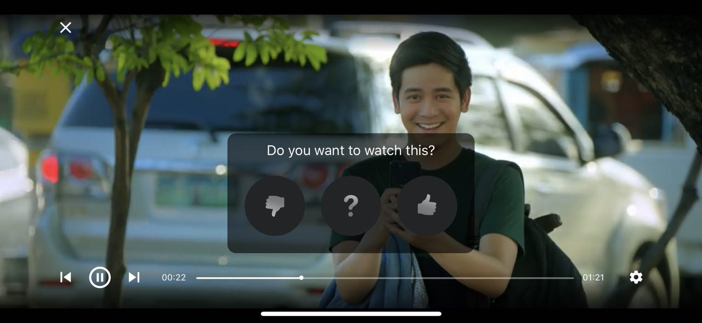

# Integration Guide

## Basic Integration

TrailerVote SDK provides the main factory class `TVTrailerVoteFactory`, containing various methods for adding the TrailerVote experience to your app.

Simply call the

```
//objective-c
[TVTrailerVoteFactory sharedFactory]

//swift
TVTrailerVoteFactory.shared()
```

class method to access the singleton instance.

Integration steps:

1. Configuring and initializing the **TrailerVote SDK**
2. Enabling and configuring the **TrailerVote In-Theatre feature**
3. Enabling the **TrailerVote Bookmarklet iconlet**
4. Presenting the **TrailerVote Video Player**
5. Enabling the **Analytics** and **Remote notifications** capabilities

## Configuring and initializing the TrailerVote SDK

In order to use the SDK, you are required to provide the set of credentials (username/password). This can be done by calling the

```
//objective-c
[TVTrailerVoteFactory setupCredentialsWithUsername:password:]

//swift
TVTrailerVoteFactory.setupCredentials(withUsername:password:)
```

method. Please note that the invocation of this method should precede any other calls on the SDK factory class, otherwise an exception will be thrown indicating the absence of credentials.

The initialization process of the SDK begins immediately upon the first invocation of `[TVTrailerVoteFactory sharedFactory]` method. All internal dependencies and SDK resources are initialized automatically.

In order for the **TrailerVote In-Theatre feature** to work offline, the movie trailers recognition data needs to be downloaded from the network.

To start the pre-loading process of the trailer recognition data, call the 

```
//objective-c
[[TVTrailerVoteFactory sharedFactory] launchDataPreload]

//swift
TVTrailerVoteFactory.shared().launchDataPreload()
```

method. Once the data is downloaded, the trailer recognition feature will be available in offline.

## Enabling and configuring the TrailerVote In-Theatre feature

The main feature of the SDK is the movie trailers recognition. We use the `TVAudioRecognitionViewController` class for presenting a full-screen user interface and for handling the recognition processes.


Instantiate the view controller by calling the `[TVTrailerVoteFactory audioRecognitionViewController]` method of the main factory class:

```
//objective-c
TVAudioRecognitionViewController * audioRecognitionVC = [[TVTrailerVoteFactory sharedFactory] audioRecognitionViewController];

//swift
let audioRecognitionVC = TVTrailerVoteFactory.shared().audioRecognitionViewController()
```

After the instantiation, the audio recognition view controller can be easily presented using UIKit `present(_:animated:completion:)` method:

```
//objective-c
[self presentViewController:audioRecognitionVC animated:YES completion:nil];

//swift
present(audioRecognitionVC, animated: true, completion: nil)
```

When the movie trailer is recognized, the voting buttons are shown with the prompt for the user to vote.


After the user votes, the feedback is recorded internally in the SDK and transmitted to TrailerVote. This means that this information is visible in the voted trailers feed and any API that exposes the vote.

*Note: Special advertisement clips, such as ad banners or special action triggers are handled differently - the fullscreen web view is presented with the corresponding url being loaded or some other UI elements are presented, such as the "Put your phones away" view.*

The SDK provides the ability to set the logo image displayed on the initial movie card. Call the

```
//objective-c
[[TVTrailerVoteFactory sharedFactory] setPartnerLogoImage:]

//swift
TVTrailerVoteFactory.shared().setPartnerLogoImage(_:)
```

method providing your own logo image to use.

You can override the default voting card background as well by calling the

```
//objective-
[[TVTrailerVoteFactory sharedFactory] setDefaultVotingCardBackgroundImage:]

//swift
TVTrailerVoteFactory.shared().setDefaultVotingCardBackgroundImage(_:)
```

method providing your own background image to use.

## Enabling the TrailerVote Bookmarket iconlet

Once a user has voted that they wish to see a movie, it’s important that intent is shown on the movie listings within the app. It’s also important that the movies that are bookmarked via TrailerVote are prioritized to the top of any screens showing movies available for watching.

To get the information on whether or not the user has previously voted on the given movie:

```
//objective-c
[[[TVTrailerVoteFactory sharedFactory] voteDataProvider] getVoteForAudioFragmentURL:completion:];

//swift
TVTrailerVoteFactory.shared().voteDataProvider().getVoteForAudioFragmentURL(_:completion:)
```


## Presenting the TrailerVote Video Player



Because moviegoers watch trailers in your movie app, we recommend replacing your video player with the **TrailerVote Video Player**. The TrailerVote Video Player will provide a prompt for voting during the video playback. 

To get the video player instance, call the

```
//objective-c
[[TVTrailerVoteFactory sharedFactory] videoPlayerViewController]

//swift
TVTrailerVoteFactory.shared().videoPlayerViewController()
```

method. The video player will automatically manage the playback queue.

## Enabling the **Analytics** and **Remote notifications** capabilities.

Both the analytics and the remote notifications capabilities require the client token to be provided to the SDK. To begin the setup, provide your token by calling the

```
//objective-c
[TVTrailerVoteFactory setupAnalyticsToken:]

//switft
TVTrailerVoteFactory.setupAnalyticsToken(_:)
```

method. The key events will be sent automatically by the SDK.

For enabling the remote notifications capability, start by calling the

```
//objective-c
[[TVTrailerVoteFactory sharedFactory] enablePushNotificationsWithDeviceID:]

//swift
TVTrailerVoteFactory.shared().enablePushNotifications(withDeviceID:)
```

method. The `deviceID` parameter is the hexadecimal string retrieved from the device token provided by the iOS in your application's delegate class `application(application:didRegisterForRemoteNotificationsWithDeviceToken:)` method.

```
//swift
func application(_ application: UIApplication, didRegisterForRemoteNotificationsWithDeviceToken deviceToken: Data) {
  TVTrailerVoteFactory.shared().enablePushNotifications(withDeviceID: deviceToken.map { String(format: "%02.2hhx", $0) }.joined())
}
```

Upon receiving the remote notification's payload dictionary in `application(_:didReceiveRemoteNotification:completionHandler:)` or `application(_:didFinishLaunchingWithOptions:)` method call the

```
//objective-c
[[TVTrailerVoteFactory sharedFactory] processPushNotificationPayload:]

//swift
TVTrailerVoteFactory.shared().processPushNotificationPayload(_:)
```

method in order for the SDK to process and react accordingly to the notification's payload data.

In some time later, when you wish to stop the remote notifications capability, call the

```
//objective-c
[[TVTrailerVoteFactory sharedFactory] disablePushNotifications] 

//swift
TVTrailerVoteFactory.shared().disablePushNotifications()
```

method to remove the current device from the notifications recepients list.
