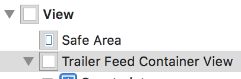
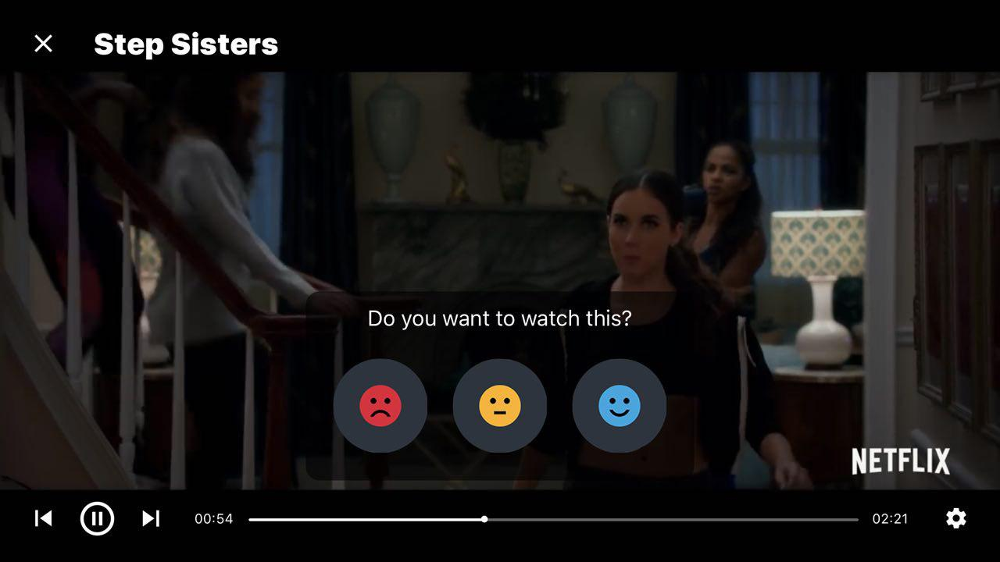

`TVMovieTrailerFeedViewController` is a class responsible for fetching, displaying and launching a video player for available movie trailers. SDK provides a simple and convenient way for embedding the feed into your app’s UI.


Instantiate the view controller by calling the `[-[TVTrailerVoteFactory movieTrailersFeedViewControllerEmbeddedInParentViewController:parentView:]](Classes/TVTrailerVoteFactory.html#/c:objc(cs)TVTrailerVoteFactory(im)movieTrailersFeedViewControllerEmbeddedInParentViewController:parentView:)` method of the main factory class:

    let trailerFeedVC = TVTrailerVoteFactory.shared().movieTrailersFeedViewControllerEmbedded(
        inParentViewController: self,
        parentView: trailerFeedContainerView
    )

`parentViewController` is a `UIViewController` instance that will be used as a parent for the trailers feed view controller, `parentView` is a `UIView` that you wish to embed the feed content into. The trailers feed view controller will automatically set all neccessary constraints so you only need to layout your container view:

When using storyboards, you can simply create a `UIView` wrapper, create an `IBOutlet` for it and instantiate the movie trailers feed view controller in your `viewDidLoad` method:



```Swift
    @IBOutlet weak var trailerFeedContainerView: UIView!

    override func viewDidLoad() {
        super.viewDidLoad()

        let trailerFeedVC = TVTrailerVoteFactory.shared().movieTrailersFeedViewControllerEmbedded(
            inParentViewController: self,
            parentView: trailerFeedContainerView
        )
    }
```

When instantiated, the movie trailers feed view controller will automatically fetch and display the movies feed. To force a feed reload, call the `[-[TVMovieTrailersFeedViewController reloadFeed]](Classes/TVMovieTrailersFeedViewController.html#/c:objc(cs)TVMovieTrailersFeedViewController(im)reloadFeed)` method.

When a movie trailer cell is tapped, a fullscreen video player is presented automatically:


The video player provides an ability to seek through the trailers in the feed using the convenient controls. The video player also presents the user with a voting view, so that the user can rate the movie that is currently playing:



Upon voted, the movie will be automatically added to user interests feed (see [User interests feed integration](./user-interests-feed) on how to set up the feed).
