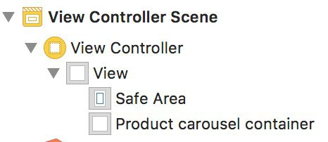

# Product carousel feed integration

`TVProductCarouselViewController` is a class responsible for fetching, displaying and launching a video player for available products. SDK provides a simple and convenient way for embedding the feed into your app's UI.


Instantiate the view controller by calling the `-[TVTrailerVoteFactory productCarouselViewControllerEmbeddedInParentViewController:parentView:]` method of the main factory class:

```
let productCarouselVC = TVTrailerVoteFactory.shared().productCarouselViewControllerEmbedded(
    inParentViewController: self,
    parentView: trailerFeedContainerView
)
```

`parentViewController` is a `UIViewController` instance that will be used as a parent for the product carousel feed view controller, `parentView` is a `UIView` that you wish to embed the feed content into. The product carousel view controller will automatically set all neccessary constraints so you only need to layout your container view:

When using storyboards, you can simply create a `UIView` wrapper, create an `IBOutlet` for it and instantiate the product carousel feed view controller in your `viewDidLoad` method:



```
@IBOutlet weak var carouselContainerView: UIView!

override func viewDidLoad() {
    super.viewDidLoad()

    let productCarouselVC = TVTrailerVoteFactory.shared().productCarouselViewControllerEmbedded(
        inParentViewController: self,
        parentView: carouselContainerView
    )
}
```

When instantiated, the product carousel view controller will automatically fetch and display the feed. To force a feed reload, call the `-[TVProductCarouselViewController reloadFeed]` method.

When a collection view cell is tapped, a fullscreen video player is presented automatically:


The video player provides an ability to seek through the trailers in the feed using the convenient controls. The video player also presents the user with a voting view, so that the user can rate the movie that is currently playing.

Upon voted, the trailer will be automatically added to the voted trailers feed (see [Voted trailers feed integration](voted_trailers_feed_integration) on how to set up the feed).
