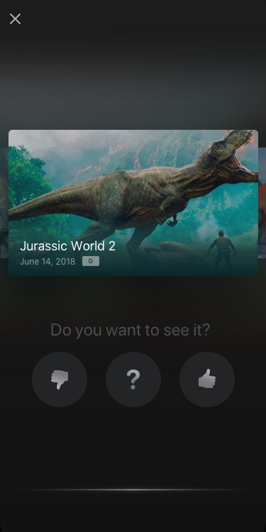

# Trailer recognition screen integration

The main feature of the SDK is the audio recognition of movie trailers. `TVAudioRecognitionViewController` is the class responsible for presenting a fullscreen UI and handling the audio recognition process.


Instantiate the view controller by calling the `-[TVTrailerVoteFactory audioRecognitionViewController]` method of the main factory class:

```
let audioRecognitionVC = TVTrailerVoteFactory.shared().audioRecognitionViewController()
```

After instantiation, the audio recognition view controller can be easily presented using `UIKit`'s `present(_:animated:completioni:)`:

```
present(audioRecognitionVC, animated: true, completion: nil)
```

When a trailer is recognized, the voting buttons are presented automatically, giving the user the ability to vote:



After voting, the trailer is automatically added to the voted trailers feed (See [Voted trailers feed integration](voted_trailers_feed_integration) for the details).

Special advertisement clips are handled differently - the fullscreen web view is presented with the corresponding url being loaded.
