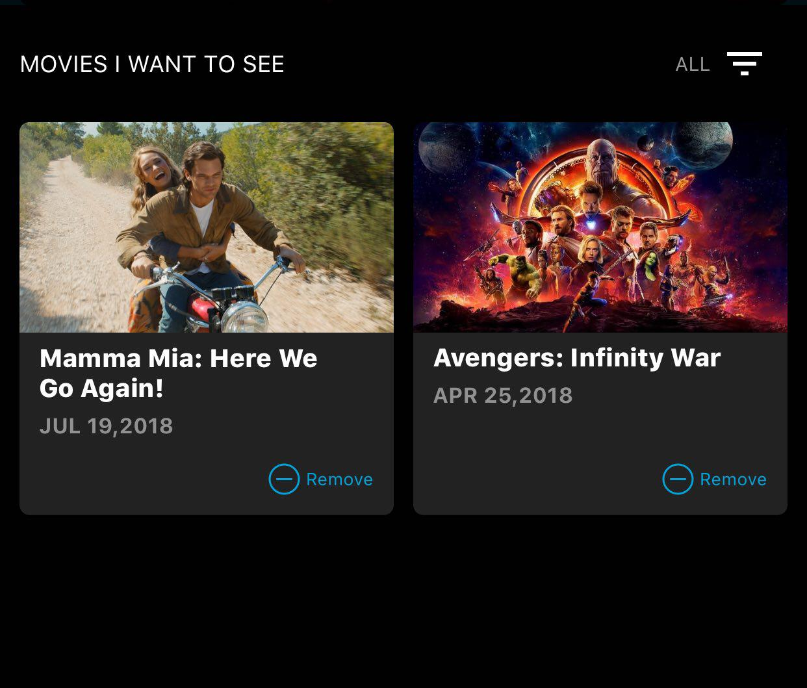
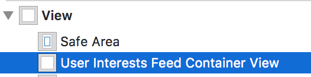
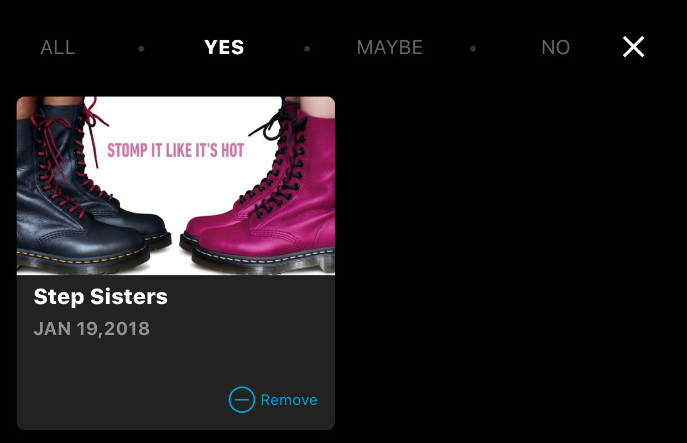

`[TVUserInterestsFeedViewController](Classes/TVUserInterestsFeedViewController.html)` is a class responsible for fetching and displaying the user interests feed which contains movies the user has previously rated. SDK provides a simple and convenient way for embedding the feed into your app’s UI.

Instantiate the view controller by calling the `[-[TVTrailerVoteFactory userInterestsFeedViewControllerEmbeddedInParentViewController:parentView:]](Classes/TVTrailerVoteFactory.html#/c:objc(cs)TVTrailerVoteFactory(im)userInterestsFeedViewControllerEmbeddedInParentViewController:parentView:)` method of the main factory class:

    let userInterestsFeedVC = TVTrailerVoteFactory.shared().userInterestsFeedViewControllerEmbedded(
        inParentViewController: self,
        parentView: userInterestsFeedContainerView
    )

`parentViewController` is a `UIViewController` instance that will be used as a parent for the trailers feed view controller, `parentView` is a `UIView` that you wish to embed the feed content into. The trailers feed view controller will automatically set all neccessary constraints so you only need to layout your container view:

When using storyboards, you can simply create a `UIView` wrapper, create an `IBOutlet` for it and instantiate the movie trailers feed view controller in your `viewDidLoad` method:

    @IBOutlet weak var userInterestsFeedContainerView: UIView!

    override func viewDidLoad() {
        super.viewDidLoad()

        let userInterestsFeedVC = TVTrailerVoteFactory.shared().userInterestsFeedViewControllerEmbedded(
            inParentViewController: self,
            parentView: userInterestsFeedContainerView
        )
    }

When instantiated, the user interests feed view controller will automatically fetch and display the feed. To force a feed reload, call the `[-[TVUserInterestsFeedViewController reloadFeed]](Classes/TVUserInterestsFeedViewController.html#/c:objc(cs)TVUserInterestsFeedViewController(im)reloadFeed)` method.

At the top of the feed there’s a header view that allows the user to filter previosly rated movies by the type of votes (`Yes`, `No` or `Maybe`):

When a movie cell is tapped, a fullscreen voting view controller is presented automatically:

See [Movie voting view controller integration](./movie-voting) for the details.
