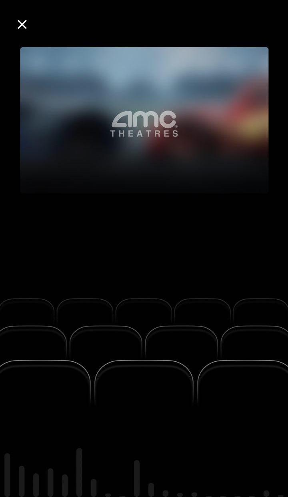
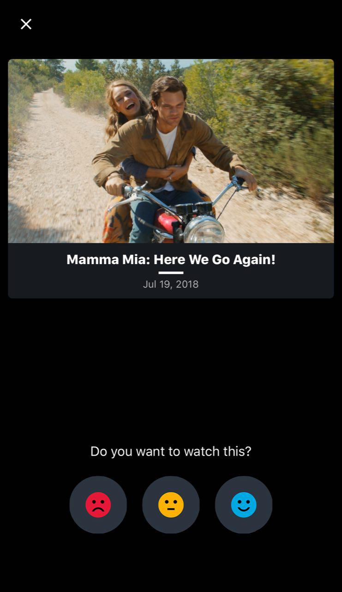

The main feature of the SDK is the audio recognition of movie trailers. `[TVAudioRecognitionViewController](Classes/TVAudioRecognitionViewController.html)` is the class responsible for presenting a fullscreen UI and handling the audio recognition process.

Instantiate the view controller by calling the `[-[TVTrailerVoteFactory audioRecognitionViewController]](Classes/TVTrailerVoteFactory.html#/c:objc(cs)TVTrailerVoteFactory(im)audioRecognitionViewController)` method of the main factory class:

    let audioRecognitionVC = TVTrailerVoteFactory.shared().audioRecognitionViewController()

After instantiation, the audio recognition view controller can be easily presented using `UIKit`‘s `present(_:animated:completioni:)`:

    present(audioRecognitionVC, animated: true, completion: nil)

When a movie is recognized, the voting view controller is presented automatically, giving the user the ability to vote on movie:

After voting, the movie is automatically added to user interests feed (See [User interests feed integration](./user-interests-feed) for the details).

Special advertisement clips are handled differently - the fullscreen advertisement banner appears, tapping on which will open the corresponding advertisement URL:

